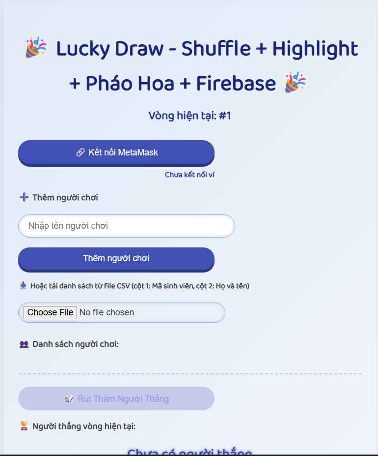
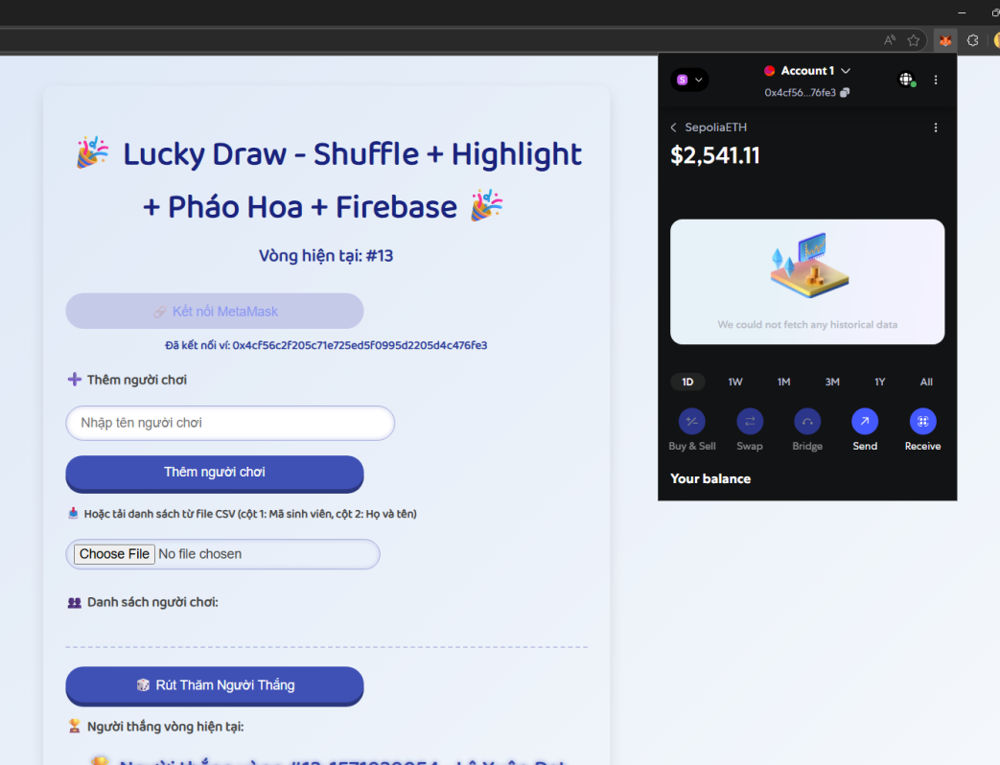
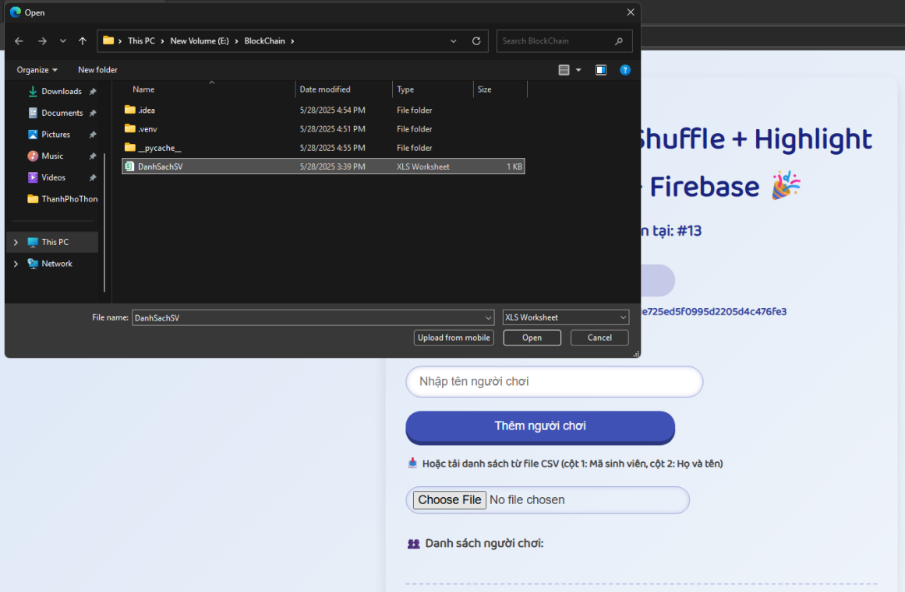
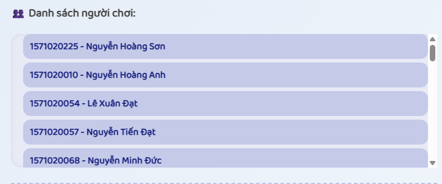
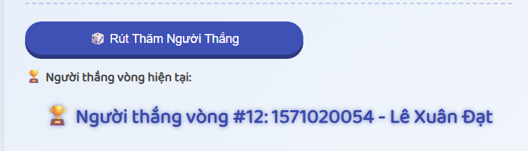
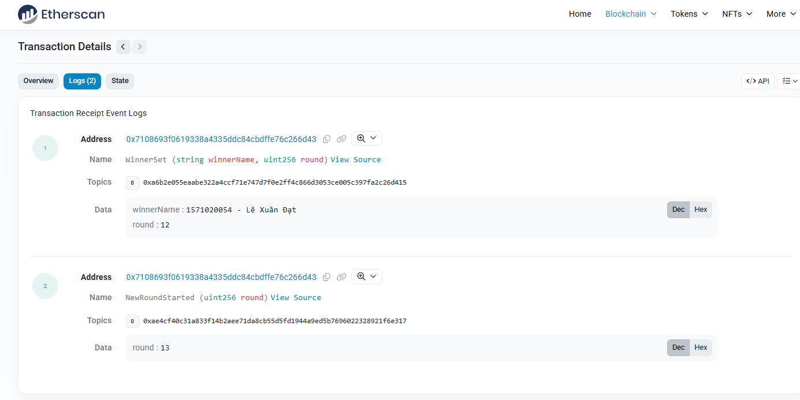
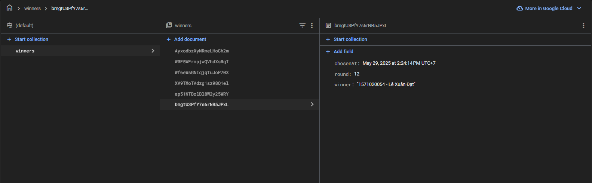

# Blockchain Rút Thăm Trúng Thưởng trong Lớp Học

## Giới Thiệu
Dự án "Blockchain Rút Thăm Trúng Thưởng trong Lớp Học" là hệ thống rút thăm may mắn phi tập trung được xây dựng trên nền tảng Ethereum. Hệ thống này cho phép tổ chức các buổi rút thăm công bằng, minh bạch với sự tham gia của sinh viên. Các kết quả rút thăm được ghi lại trên blockchain, bảo đảm tính toàn vẹn và không thể thay đổi.

## Tính Năng Chính
- **Triển khai hợp đồng thông minh** trên Ethereum Sepolia testnet.
- **Giao diện người dùng** dễ sử dụng để tham gia rút thăm.
- **Hiển thị kết quả ngẫu nhiên** một cách minh bạch và công bằng.
- **Lưu trữ kết quả** trên Firebase và Blockchain để dễ dàng quản lý và kiểm tra.
- **Chức năng tải lên danh sách sinh viên** qua file CSV hoặc thêm thủ công.
- **Chọn người thắng ngẫu nhiên** từ danh sách sinh viên tham gia.
- **Hiệu ứng pháo hoa** khi người thắng được chọn, tạo không khí vui tươi cho sự kiện.
- **Lưu thông tin kết quả**: Kết quả người thắng được ghi lại trên Firebase và smart contract trên Ethereum.

## Công Nghệ Sử Dụng
- **Solidity**: Ngôn ngữ lập trình để phát triển hợp đồng thông minh.
- **Web3.js**: Thư viện JavaScript cho phép tương tác với Ethereum blockchain.
- **Firebase**: Dịch vụ backend để lưu trữ dữ liệu và quản lý thông tin người tham gia và kết quả.
- **MetaMask**: Ví Ethereum để kết nối với blockchain và thực hiện các giao dịch.
- **HTML/CSS/JavaScript**: Để xây dựng giao diện người dùng trên web.
- **Confetti.js**: Thư viện để tạo hiệu ứng pháo hoa khi người thắng được chọn.

## Luồng Hoạt Động Chính
1. **Giao diện người dùng**  
   
   

2. **Kết nối đến ví MetaMask**  
   
   

3. **Tải file danh sách sinh viên lên**  
   
  

4. **Hiển thị danh sách sinh viên tham gia**  
   
   

5. **Rút thăm tìm ra người may mắn**  
   
   

6. **Mã hash và thông tin người chiến thắng được gửi lên Blockchain**  
   
  

7. **Lưu kết quả trên Firebase để dễ dàng quản lý**  
   
   

## Hướng Dẫn Chạy Dự Án

### Mô Tả Dự Án
Hệ thống "Rút Thăm Trúng Thưởng trong Lớp Học" là một ứng dụng web sử dụng công nghệ Web3.js, Firebase và MetaMask, cho phép người tham gia thêm thủ công hoặc tải file CSV chứa thông tin sinh viên. Hệ thống sẽ chọn ngẫu nhiên người thắng và lưu trữ kết quả lên smart contract trên Ethereum và Firebase.

### Tính Năng:
- **Kết nối MetaMask**: Cho phép ứng dụng tương tác với Blockchain Ethereum thông qua MetaMask.
- **Thêm người tham gia**: Người tham gia có thể thêm thủ công hoặc tải lên file CSV.
- **Chọn người thắng ngẫu nhiên**: Danh sách người tham gia sẽ được xáo trộn, và người thắng sẽ được làm nổi bật.
- **Hiệu ứng pháo hoa**: Mừng chiến thắng với hiệu ứng pháo hoa.
- **Lưu kết quả**: Lưu trữ kết quả người thắng trên cả Firebase và Blockchain Ethereum.

### Yêu Cầu:
- **MetaMask**: Đảm bảo bạn đã cài đặt MetaMask và kết nối với mạng Ethereum Sepolia testnet.
- **Firebase**: Cấu hình Firebase Firestore cho dự án và thay thế thông tin cấu hình trong mã nguồn.
- **Web3.js**: Cần thiết để tương tác với Ethereum Blockchain.
- **Confetti.js**: Dùng để tạo hiệu ứng pháo hoa khi người thắng được chọn.
```bash
### Hướng Dẫn Cài Đặt:
#### 1. Clone Repository:
Đầu tiên, bạn cần clone repository về máy của mình:
git clone https://github.com/yourusername/your-repository.git
cd your-repository
2. Cài Đặt Các Thư Viện Phụ Thuộc:
Dự án này không yêu cầu cài đặt thư viện ngoài. Các thư viện như Web3.js, Confetti.js và Firebase được tải trực tiếp từ các CDN. Đảm bảo kết nối internet ổn định để tải các thư viện này.

3. Cấu Hình Firebase:
Truy cập vào Firebase Console.

Tạo một dự án Firebase mới và cấu hình Firebase Firestore.

Lấy thông tin cấu hình Firebase từ dự án của bạn và thay thế vào đoạn mã trong firebaseConfig trong tệp index.html hoặc app.js (tùy thuộc vào nơi bạn cấu hình Firebase).

Ví dụ cấu hình Firebase:
const firebaseConfig = {
  apiKey: "YOUR_API_KEY",
  authDomain: "YOUR_AUTH_DOMAIN",
  projectId: "YOUR_PROJECT_ID",
  storageBucket: "YOUR_STORAGE_BUCKET",
  messagingSenderId: "YOUR_MESSAGING_SENDER_ID",
  appId: "YOUR_APP_ID",
  measurementId: "YOUR_MEASUREMENT_ID"
};
firebase.initializeApp(firebaseConfig);
4. Triển Khai Smart Contract:
Để triển khai smart contract, bạn cần có ví Ethereum (MetaMask) và một mạng thử nghiệm của Ethereum (như Sepolia).

Thay thế địa chỉ của smart contract trong mã nguồn của bạn (tìm phần mã có chứa contractAddress).

Cài đặt Remix IDE để phát triển và triển khai hợp đồng thông minh của bạn lên mạng Sepolia hoặc bất kỳ testnet nào mà bạn chọn.

5. Chạy Dự Án:
Sau khi cài đặt và cấu hình xong các phần trên, bạn có thể mở tệp index.html trong trình duyệt của mình để chạy dự án.

Kết nối MetaMask với Blockchain Ethereum.

Thêm người tham gia thủ công hoặc tải lên file CSV chứa danh sách sinh viên.

Rút thăm người thắng và tận hưởng hiệu ứng hoạt hình và pháo hoa.

Liên Hệ
Tác giả: Nguyễn Duy Quang

Email: quangduy1923@gmail.com

Chúc bạn thành công với dự án Blockchain rút thăm trúng thưởng!
